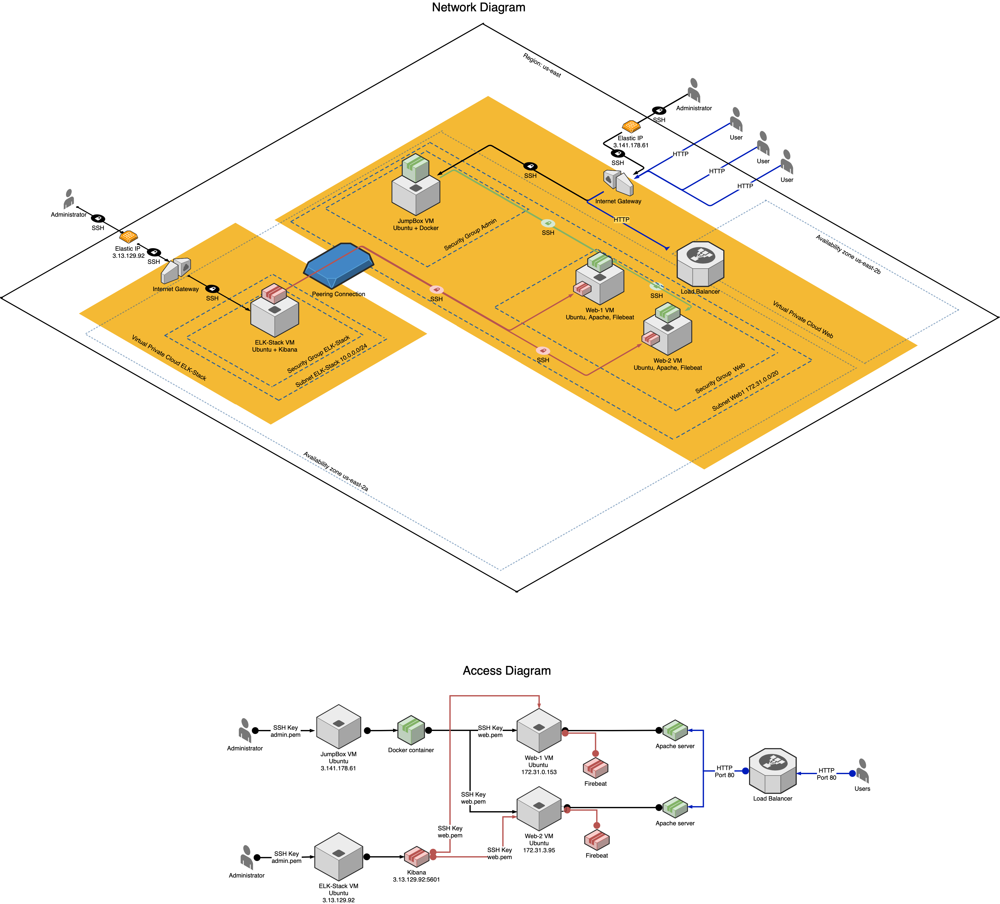

## Automated ELK Stack Deployment

The files in this repository were used to configure the network depicted below.



These files have been tested and used to generate a live ELK deployment on Azure. They can be used to recreate the entire deployment pictured above. Alternatively, select portions of the _____ file may be used to install only certain pieces of it, such as Filebeat.

  - _TODO: Enter the playbook file._

This document contains the following details:
- Description of the Topology
- Access Policies
- ELK Configuration
  - Beats in Use
  - Machines Being Monitored
- How to Use the Ansible Build


### Description of the Topology

The main purpose of this network is to expose a load-balanced and monitored instance of DVWA, the D*mn Vulnerable Web Application.

Load balancing ensures that the application will be highly available, in addition to restricting access to the network.

Integrating an ELK server allows users to easily monitor the vulnerable VMs for changes to the log files and system metrics.

The configuration details of each machine may be found below.

| Name     | VPC | Function                | IP Address   | Operating System | RSA Key        |
|----------|-----|-------------------------|--------------|------------------|----------------|
| JumpBox  | Web | Gateway                 | 3.141.178.61 | Linux            | jumpbox.pem    |
| Web-1    | Web | Primary Apache server   | 172.31.0.153 | Linux            | web.pem        |
| Web-2    | Web | Secondary Apache server | 172.31.3.95  | Linux            | web.pem        |
| ELK      | ELK | Kibana                  | 3.13.129.92  | Linux            | elk-stack.pem  |

### Access Policies

The machines on the internal network are not exposed to the public Internet. 

Only the JumpBox and ELK machines can accept connections from the Internet. Access to these machine are only allowed from the following IP address:
- 49.180.242.201

Web hosting machines within the network can only be accessed by SSH via JumpBox with an RSA key.
- ELK VM is accessible via an SSH from IP 49.180.242.201 and a dedicated RSA key identified in the table above. 

A summary of the access policies in place can be found in the table below.

| Name     | Publicly Accessible | Allowed IP Addresses |
|----------|---------------------|----------------------|
| Jump Box | Yes                 | 49.180.242.201       |
| Web-1    | No                  |                      |
| Web-2    | No                  |                      |
| ELK      | Yes                 | 49.180.242.201       |

### Elk Configuration

Ansible was used to automate configuration of the ELK machine. No configuration was performed manually, which is advantageous because it enables near-instant scaling of the existing infrastructure and automated configuration and maintenance of the technology stack across the entire enterprise's infrastructure.

The playbook implements the following tasks:
- Update Linux app environment 
- Install or update Docker
- Download a Docker image
- Configure a Docker image
- Launch a Docker image
- Perform commands on Docker image startup
- Install or update an Apache server
- Launch an Apache server

The following screenshot displays the result of running `docker ps` after successfully configuring the ELK instance.


### Target Machines & Beats
This ELK server is configured to monitor the following machines:
- Web-1 | 172.31.0.153
- Web-2 | 172.31.3.95

We have installed the following Beats on these machines:
- Filebeat

These Beats allow us to collect the following information from each machine:
- Filebeat is a tool for centralising log data. Filebeat monitors changes in log files and user-specified files, and forwards them either to Elasticsearch or Logstash for indexing. Filebeat uses inputs to identify file types, and configures harvesters to monitor individual files.

### Preparing Host Machine
Configuring and consequently testing an array of remote virtual machines involves frequent switches of the SSH connections. In order to automate this task and avoiding having to remember individual VM's IPs, the following step is encouraged (for Mac/Linux users). 
- Access copies of your RSA keys and place them in the following diretory: ~/.ssh. For example, ~/.ssh/jumpbox.pem
- Depending on the strategy selected to procure the RSA file, user may need to modify file permissions to 400.
```
chmod 400 jumpbox.pem 
```
- Copy the contents of 'config' file to ~/.ssh/config. This will require admin privileges.
```
sudo nano ~/.ssh/config
```
- Edit the ~/.ssh/config file to replace IPs with the remote machines' IPs of the target organisation
- Start an SSH session with the following command. The command will automatically use a .pem key for the target VM's IP address.
```
ssh JumpBox
```
- Once inside the JumpBox, check the list of Docker containers:
```
sudo docker ps
```
- Start the target container and attach to it:
```
sudo docker start magical_leavitt 
sudo docker attach magical_leavitt 
``` 


### Using the Playbook
In order to use the playbook, Ansible control node will need to already be configured. Assuming such a control node has already been provisioned: 

SSH into the control node and follow the steps below:
- Start a cyberxsecurity/dvwa container:
```
sudo docker start magical_leavitt 
sudo docker attach magical_leavitt 
```
- Copy the YAML files from the /playbooks directory to a preferred directory on the control node's Docker instance.
- Navigate to the directory in Docker instance which contains Ansible playbooks. Update the YAML files to include IP addresses of the virtual machines.
```
nano web-playbook.yml
```
- Copy the contents from the /variables directory to ./vars directory on the control node.
- Run the playbook, and navigate to the identified managed nodes to check that the installation worked as expected.

- Ansible Playbook is a YAML configuration file with a .yml extension. It is recommended to store the file in a secure location easily accessible by automation tools; however, the file can be launched into action from any directory with the following command:
```
ansible-playbook elk-playbook.yml 
```
- There are a number of startegies for targeting a specific virtual machine with an Ansible playbook. One of the most efficient startegies would be to update a local variable collection file which can then be used to target a specific host in the playbook. For example:
Edit the hosts file to specify a new host group.
```
nano /etc/ansible/hosts
```
```
[elk]
18.118.128.74

[elk:vars]
ansible_python_interpreter=/usr/bin/python3
ansible_user=ubuntu
ansible_ssh_private_key_file=/root/ELK-Stack.pem
```
In the relevant playbook, edit hosts to identify the target host group from the /etc/ansible/hosts file. Identify variables in a dedicated file, such as ./vars/elk-defaults.yml. Example of the playbook header:
```
- name: ELK Stack
  hosts: elk
  become: true
  vars_files:
    - ./vars/elk-defaults.yml
```
- In order to check that the ELK server is running, navigate to a URL that consists of the ELK server's IP and a port which was configured to host Kibana earlier. For example:
http://3.13.129.92:5601
